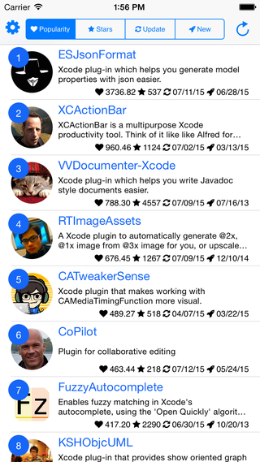
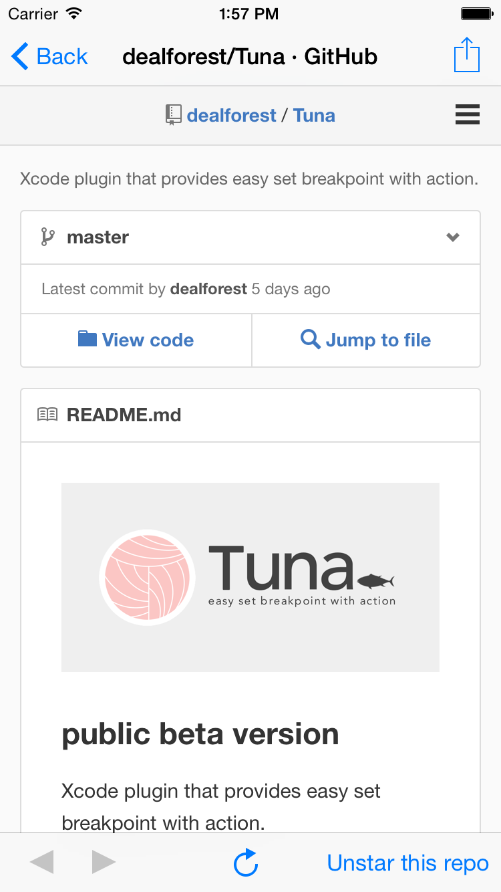

An iOS app which shows Xcode plugins ranking.

[](https://itunes.apple.com/us/app/alcatraztour/id973816100?mt=8)

## Screen Shots

 

## Requirements

* iOS 8.0 or later

## How to build?

1. Create a new app [here](https://github.com/settings/applications/new).
2. Get consumerKey and consumerSecret.
3. Write below to SecretConstants.swift. 

  ```
  let GithubKey =
  [
      "consumerKey": "yourConsumerKey",
      "consumerSecret": "yourConsumerSecret"
  ]
  ```
  
4. Open AlcatrazTour.xcworkspace with Xcode and build.
